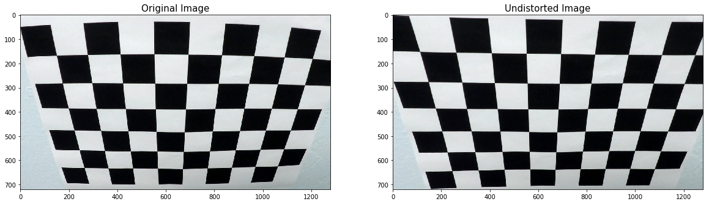
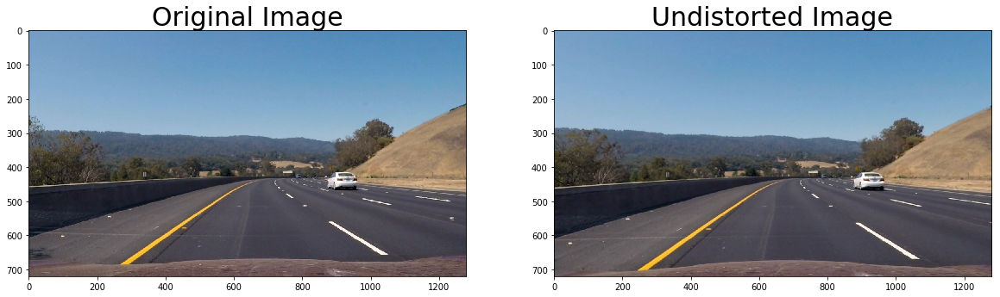
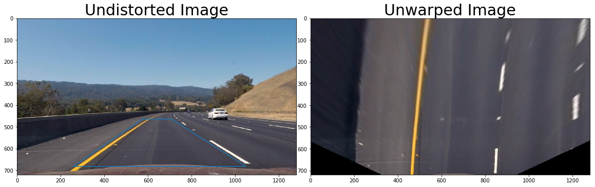
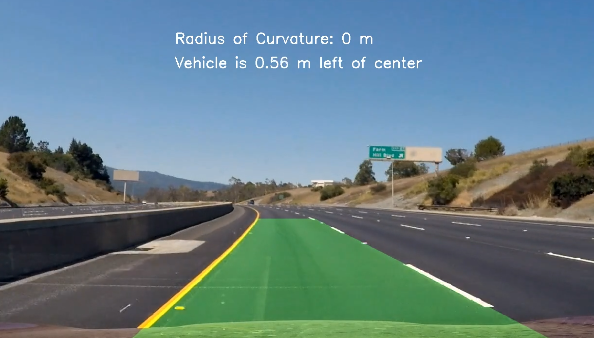

## Advanced Lane Finding
In this project, our goal is to write a software pipeline to identify the lane boundaries in a video. Following steps were implemented to acheive the goal :

* Compute the camera calibration matrix and distortion coefficients given a set of chessboard images.
* Apply a distortion correction to raw images.
* Use color transforms, gradients, etc., to create a thresholded binary image.
* Apply a perspective transform to rectify binary image ("birds-eye view").
* Detect lane pixels and fit to find the lane boundary.
* Determine the curvature of the lane and vehicle position with respect to center.
* Warp the detected lane boundaries back onto the original image.
* Output visual display of the lane boundaries and numerical estimation of lane curvature and vehicle position.

### Camera calibration
1. Briefly state how you computed the camera matrix and distortion coefficients. Provide an example of a distortion corrected calibration image.

1. Convert to grayscale
2. Find the chessboard corners
3. Get objpoints and imgpoints
4. Undistort image uisng cv2.undistort function

Pipeline (single images)

1. Provide an example of a distortion-corrected image.

2. Describe how (and identify where in your code) you used color transforms, gradients or other methods to create a thresholded binary image. Provide an example of a binary image result.

I used a combination of color and gradient thresholds to generate a binary image

Sobel Absolute Threshold:

Sobel Magnitude Threshold:

Sobel Directional Threshold:

HLS S-Channel Threshold:

HLS L-Channel Threshold:

3. Describe how (and identify where in your code) you performed a perspective transform and provide an example of a transformed image.

| Source        | Destination   |
| ------------- |:-------------:| 
| (575,464)     | (450,0)     |
| (707,464)     | (830,0)    |
| (258,682)     | (450,720)    |
| (1049,682)    | (830,720)     |

4. Describe how (and identify where in your code) you identified lane-line pixels and fit their positions with a polynomial?

Two approaches were implemented for finding lane lines. The first approach is the window sliding method which is used when prior lane information does not exist or missing. Although this appraoch is often more robust, it is also computationally time consuming. The other approach is searching for lane pixels in a target region determined by the previous window frame. The second approach is less compuationally intensive and is used for most of the video frames.
function > fit_lanes()

5. Describe how (and identify where in your code) you calculated the radius of curvature of the lane and the position of the vehicle with respect to center.

I used np.polyfit() function.
function > find_lanes() > find_curvature()

6. Provide an example image of your result plotted back down onto the road such that the lane area is identified clearly.

function > draw_poly() 

